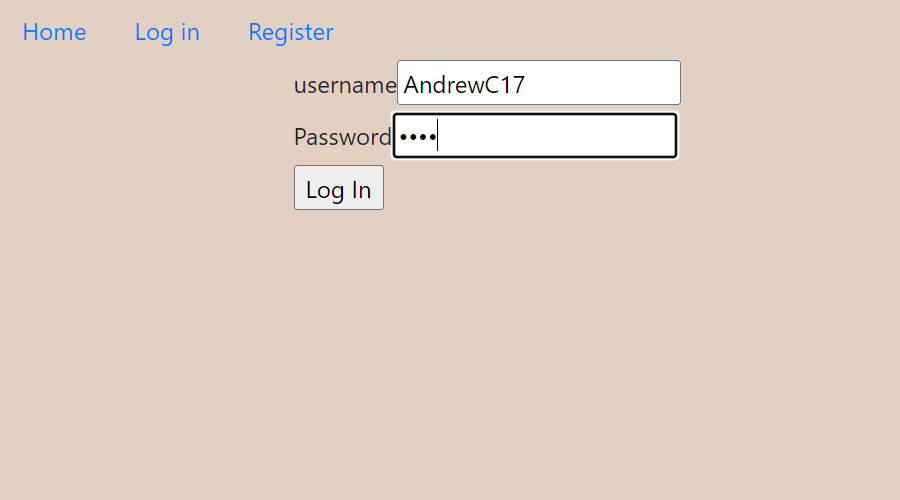

# Python-Capstone-Recipe-Finder
A web application that allows users to search for recipes that they have ingredients for. Currently running on small json file for the search of recipes just for demonstration.

Youtube link of Capstone presenation for DevMountain: https://www.youtube.com/watch?v=L1JWOB--juY&t=3s

## Technologies Used:
* Python
* Flask
* Flask-login
* SQLAlchemy
* WTForms
* Bootstrap

The application allows users to register a user profile, allow the user to login or logout, rate and review recipes, leave notes on what they would do differently, and add their own recipe to the database. 

The users will be able to search for recipes based off ingredients they have in their pantry. The idea came to me one evening when I had a bunch of random left over ingredients in my pantry and I was curious to know if I could make a meal out of what I had left. The idea morphed into a cook book database that will allow the users to search for the recipes that are available with what they have left.  

## Home Screen and Main Search Function
For quick recipe searches for users who do not want to make a profile and want a quick search.

## Profile Page
Allows users to create a profile and track their recipes.

## Add Recipe Function
Allows users to add recipes to the database of recipes

## Add Rating
Allows the user to rate the recipe they just made and leave notes for the next time they attempt to make the recipe.

## User Registration
Allows users to register a profile and set their username and password.

## User Login
Allows the user to use their credentials to login into their profile.

